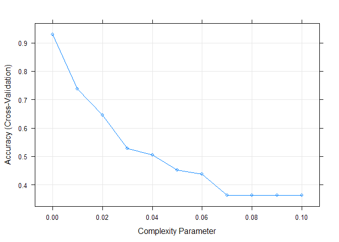
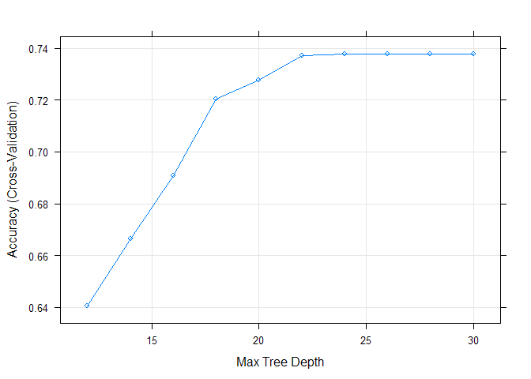

## Background and Introduction

Using devices such as Jawbone Up, Nike FuelBand, and Fitbit it is now possible to collect a large amount of data about personal activity relatively inexpensively. These type of devices are part of the quantified self movement - a group of enthusiasts who take measurements about themselves regularly to improve their health, to find patterns in their behavior, or because they are tech geeks. One thing that people regularly do is quantify how much of a particular activity they do, but they rarely quantify how well they do it.

In this project, we will use data from accelerometers on the belt, forearm, arm, and dumbell of 6 participants. they were asked to perform one set of 10 repetitions of the Unilateral Dumbbell Biceps Curl in five different fashions: exactly according to the specification (Class A), throwing the elbows to the front (Class B), lifting the dumbbell only halfway (Class C), lowering the dumbbell only halfway (Class D), and throwing the hips to the front (Class E). Class A corresponds to the specified execution of the exercise, while the other 4 classes correspond to common mistakes. Our goal will be to predict the manner in which the exercise was performed using provided data. More information is available from the website here: http://groupware.les.inf.puc-rio.br/har (see the section on the Weight Lifting Exercise Dataset).

## Getting and Cleaning the data

I start by loading the required packages:


```r
library(caret)
library(rpart)
library(randomForest)
```

And then loading the training and testing datasets:


```r
NA_strings <- c("NA","#DIV/0!","")
orig_train <- read.csv("pml-training.csv", na.strings = NA_strings)
testing <- read.csv("pml-testing.csv", na.strings = NA_strings)
```

Next I explore the training set and choose potential variables to predict the outcome with. The training dataset has 19622 observations and 160 variables. First seven variables aren't measurements related to the outcome, So we can safely exclude them.


```r
training <- orig_train[, -c(1:7)]
```

Next let's search for the distribution of `NA`s in the data. Variables with lots of `NA`s will be excluded.


```r
NA_count <- sapply(training, function(x) sum(is.na(x)))
NA_count
```

```
##                roll_belt               pitch_belt                 yaw_belt 
##                        0                        0                        0 
##         total_accel_belt       kurtosis_roll_belt      kurtosis_picth_belt 
##                        0                    19226                    19248 
##        kurtosis_yaw_belt       skewness_roll_belt     skewness_roll_belt.1 
##                    19622                    19225                    19248 
##        skewness_yaw_belt            max_roll_belt           max_picth_belt 
##                    19622                    19216                    19216 
##             max_yaw_belt            min_roll_belt           min_pitch_belt 
##                    19226                    19216                    19216 
##             min_yaw_belt      amplitude_roll_belt     amplitude_pitch_belt 
##                    19226                    19216                    19216 
##       amplitude_yaw_belt     var_total_accel_belt            avg_roll_belt 
##                    19226                    19216                    19216 
##         stddev_roll_belt            var_roll_belt           avg_pitch_belt 
##                    19216                    19216                    19216 
##        stddev_pitch_belt           var_pitch_belt             avg_yaw_belt 
##                    19216                    19216                    19216 
##          stddev_yaw_belt             var_yaw_belt             gyros_belt_x 
##                    19216                    19216                        0 
##             gyros_belt_y             gyros_belt_z             accel_belt_x 
##                        0                        0                        0 
##             accel_belt_y             accel_belt_z            magnet_belt_x 
##                        0                        0                        0 
##            magnet_belt_y            magnet_belt_z                 roll_arm 
##                        0                        0                        0 
##                pitch_arm                  yaw_arm          total_accel_arm 
##                        0                        0                        0 
##            var_accel_arm             avg_roll_arm          stddev_roll_arm 
##                    19216                    19216                    19216 
##             var_roll_arm            avg_pitch_arm         stddev_pitch_arm 
##                    19216                    19216                    19216 
##            var_pitch_arm              avg_yaw_arm           stddev_yaw_arm 
##                    19216                    19216                    19216 
##              var_yaw_arm              gyros_arm_x              gyros_arm_y 
##                    19216                        0                        0 
##              gyros_arm_z              accel_arm_x              accel_arm_y 
##                        0                        0                        0 
##              accel_arm_z             magnet_arm_x             magnet_arm_y 
##                        0                        0                        0 
##             magnet_arm_z        kurtosis_roll_arm       kurtosis_picth_arm 
##                        0                    19294                    19296 
##         kurtosis_yaw_arm        skewness_roll_arm       skewness_pitch_arm 
##                    19227                    19293                    19296 
##         skewness_yaw_arm             max_roll_arm            max_picth_arm 
##                    19227                    19216                    19216 
##              max_yaw_arm             min_roll_arm            min_pitch_arm 
##                    19216                    19216                    19216 
##              min_yaw_arm       amplitude_roll_arm      amplitude_pitch_arm 
##                    19216                    19216                    19216 
##        amplitude_yaw_arm            roll_dumbbell           pitch_dumbbell 
##                    19216                        0                        0 
##             yaw_dumbbell   kurtosis_roll_dumbbell  kurtosis_picth_dumbbell 
##                        0                    19221                    19218 
##    kurtosis_yaw_dumbbell   skewness_roll_dumbbell  skewness_pitch_dumbbell 
##                    19622                    19220                    19217 
##    skewness_yaw_dumbbell        max_roll_dumbbell       max_picth_dumbbell 
##                    19622                    19216                    19216 
##         max_yaw_dumbbell        min_roll_dumbbell       min_pitch_dumbbell 
##                    19221                    19216                    19216 
##         min_yaw_dumbbell  amplitude_roll_dumbbell amplitude_pitch_dumbbell 
##                    19221                    19216                    19216 
##   amplitude_yaw_dumbbell     total_accel_dumbbell       var_accel_dumbbell 
##                    19221                        0                    19216 
##        avg_roll_dumbbell     stddev_roll_dumbbell        var_roll_dumbbell 
##                    19216                    19216                    19216 
##       avg_pitch_dumbbell    stddev_pitch_dumbbell       var_pitch_dumbbell 
##                    19216                    19216                    19216 
##         avg_yaw_dumbbell      stddev_yaw_dumbbell         var_yaw_dumbbell 
##                    19216                    19216                    19216 
##         gyros_dumbbell_x         gyros_dumbbell_y         gyros_dumbbell_z 
##                        0                        0                        0 
##         accel_dumbbell_x         accel_dumbbell_y         accel_dumbbell_z 
##                        0                        0                        0 
##        magnet_dumbbell_x        magnet_dumbbell_y        magnet_dumbbell_z 
##                        0                        0                        0 
##             roll_forearm            pitch_forearm              yaw_forearm 
##                        0                        0                        0 
##    kurtosis_roll_forearm   kurtosis_picth_forearm     kurtosis_yaw_forearm 
##                    19300                    19301                    19622 
##    skewness_roll_forearm   skewness_pitch_forearm     skewness_yaw_forearm 
##                    19299                    19301                    19622 
##         max_roll_forearm        max_picth_forearm          max_yaw_forearm 
##                    19216                    19216                    19300 
##         min_roll_forearm        min_pitch_forearm          min_yaw_forearm 
##                    19216                    19216                    19300 
##   amplitude_roll_forearm  amplitude_pitch_forearm    amplitude_yaw_forearm 
##                    19216                    19216                    19300 
##      total_accel_forearm        var_accel_forearm         avg_roll_forearm 
##                        0                    19216                    19216 
##      stddev_roll_forearm         var_roll_forearm        avg_pitch_forearm 
##                    19216                    19216                    19216 
##     stddev_pitch_forearm        var_pitch_forearm          avg_yaw_forearm 
##                    19216                    19216                    19216 
##       stddev_yaw_forearm          var_yaw_forearm          gyros_forearm_x 
##                    19216                    19216                        0 
##          gyros_forearm_y          gyros_forearm_z          accel_forearm_x 
##                        0                        0                        0 
##          accel_forearm_y          accel_forearm_z         magnet_forearm_x 
##                        0                        0                        0 
##         magnet_forearm_y         magnet_forearm_z                   classe 
##                        0                        0                        0
```

So either a variable contains no `NA`s or it's mostly `NA`s. I will Just keep those who have zero `NA`s.


```r
training <- training[, NA_count == 0]
dim(training)
```

```
## [1] 19622    53
```

I will use the 53 remaining variables as predictors. Finaly divide the training data into two sets: a training set and a validation set:


```r
set.seed(1312)
train_idx <- createDataPartition(training$class, p = 0.7, list = FALSE)
training <- training[train_idx, ]
validation <- training[-train_idx, ]
```

## Model building

After reading the original article, I decided to use Random Forest algorithm as the original authers did and obtained accurate results. But first I will use a classification tree. Since variable transformation is not relevant to build model with tree based methods, I won't transform any variable.

### Classification Trees

To predict with a classication tree, I use rpart package. First let's use `rpart` function without any tuning:


```r
set.seed(1312)
mod_rpart <- rpart(classe ~ ., data = training, method = "class")
```

And then apply the model to the validation set:


```r
pred_rpart <- predict(mod_rpart, newdata = validation, type = "class")
confusionMatrix(pred_rpart, validation$classe)
```

```
## Confusion Matrix and Statistics
## 
##           Reference
## Prediction    A    B    C    D    E
##          A 1058  166   17   74   32
##          B   28  507   54   23   50
##          C   26   88  564   98   81
##          D   11   46   54  434   46
##          E   24   38   11   40  541
## 
## Overall Statistics
##                                           
##                Accuracy : 0.755           
##                  95% CI : (0.7416, 0.7681)
##     No Information Rate : 0.279           
##     P-Value [Acc > NIR] : < 2.2e-16       
##                                           
##                   Kappa : 0.689           
##  Mcnemar's Test P-Value : < 2.2e-16       
## 
## Statistics by Class:
## 
##                      Class: A Class: B Class: C Class: D Class: E
## Sensitivity            0.9224   0.6000   0.8057   0.6487   0.7213
## Specificity            0.9025   0.9525   0.9141   0.9544   0.9664
## Pos Pred Value         0.7854   0.7659   0.6581   0.7343   0.8272
## Neg Pred Value         0.9678   0.9020   0.9582   0.9332   0.9395
## Prevalence             0.2790   0.2055   0.1703   0.1627   0.1824
## Detection Rate         0.2574   0.1233   0.1372   0.1056   0.1316
## Detection Prevalence   0.3277   0.1610   0.2085   0.1438   0.1591
## Balanced Accuracy      0.9125   0.7763   0.8599   0.8016   0.8439
```

As can be seen, the estimated accuracy of the model is 75%. To tune the rpart model, the most important parameter is the complexity parameter. We can use cross validation to choose this parameter.


```r
set.seed(1312)
tune_cp_rpart <- train(classe ~ ., data = training, method = "rpart",
                       trControl = trainControl(method = "cv", number = 10),
                       tuneGrid = expand.grid(cp = seq(0, 0.1, by = 0.01)))
tune_cp_rpart
```

```
## CART 
## 
## 13737 samples
##    52 predictor
##     5 classes: 'A', 'B', 'C', 'D', 'E' 
## 
## No pre-processing
## Resampling: Cross-Validated (10 fold) 
## Summary of sample sizes: 12365, 12364, 12365, 12363, 12363, 12362, ... 
## Resampling results across tuning parameters:
## 
##   cp    Accuracy   Kappa    
##   0.00  0.9285861  0.9096674
##   0.01  0.7376425  0.6666429
##   0.02  0.6449824  0.5532829
##   0.03  0.5289357  0.3897153
##   0.04  0.5055649  0.3585533
##   0.05  0.4524189  0.2698523
##   0.06  0.4386734  0.2470483
##   0.07  0.3641284  0.1217236
##   0.08  0.3641284  0.1217236
##   0.09  0.3641284  0.1217236
##   0.10  0.3641284  0.1217236
## 
## Accuracy was used to select the optimal model using  the largest value.
## The final value used for the model was cp = 0.
```

```r
plot(tune_cp_rpart)
```

<!-- -->

Looking at the plot above, the best accuracy obtained with `cp = 0`. This is the value chosen for the model by the `train` function. Next I will try to tune `maxdepth` parameter also by using cross validation. But first I want to check it's value in untuned model. rpart has an unexported function `tree.depth` that gives the depth of each node in the vector of node numbers passed on to it.


```r
nodes <- as.numeric(rownames(mod_rpart$frame))
max(rpart:::tree.depth(nodes))
```

```
## [1] 13
```

```r
set.seed(1312)
tune_maxdepth_rpart <- train(classe ~ ., data = training, method = "rpart2",
                             trControl = trainControl(method = "cv", number = 10),
                             tuneGrid = expand.grid(maxdepth = seq(12, 30, by = 2)))
tune_maxdepth_rpart
```

```
## CART 
## 
## 13737 samples
##    52 predictor
##     5 classes: 'A', 'B', 'C', 'D', 'E' 
## 
## No pre-processing
## Resampling: Cross-Validated (10 fold) 
## Summary of sample sizes: 12365, 12364, 12365, 12363, 12363, 12362, ... 
## Resampling results across tuning parameters:
## 
##   maxdepth  Accuracy   Kappa    
##   12        0.6406858  0.5482808
##   14        0.6663803  0.5796265
##   16        0.6908399  0.6090754
##   18        0.7205314  0.6450263
##   20        0.7276681  0.6540544
##   22        0.7372058  0.6660862
##   24        0.7376425  0.6666429
##   26        0.7376425  0.6666429
##   28        0.7376425  0.6666429
##   30        0.7376425  0.6666429
## 
## Accuracy was used to select the optimal model using  the largest value.
## The final value used for the model was maxdepth = 24.
```

```r
plot(tune_maxdepth_rpart)
```

<!-- -->

Based on the plot above, the optimal value for `maxdepth` parameter seems to be 24. This is also the value chosen by the `train` function. But the parameter value in the untuned model was 13.

Next let's build a tree model with the `rpart` function again. But this time with tuning parameters chosen at the previous steps:


```r
set.seed(1312)
mod_rpart_tuned <- rpart(classe ~ ., data = training, method = "class",
                         control = rpart.control(cp = 0, maxdepth = 24))
```

Now we can apply the prediction model to the validation set.


```r
pred_rpart_tuned <- predict(mod_rpart_tuned, newdata = validation, type = "class")
confusionMatrix(pred_rpart_tuned, validation$classe)
```

```
## Confusion Matrix and Statistics
## 
##           Reference
## Prediction    A    B    C    D    E
##          A 1127   12    8    4    2
##          B   12  807   14   11   12
##          C    4   12  669   14   12
##          D    1    8    7  635    7
##          E    3    6    2    5  717
## 
## Overall Statistics
##                                           
##                Accuracy : 0.9621          
##                  95% CI : (0.9558, 0.9677)
##     No Information Rate : 0.279           
##     P-Value [Acc > NIR] : <2e-16          
##                                           
##                   Kappa : 0.952           
##  Mcnemar's Test P-Value : 0.1064          
## 
## Statistics by Class:
## 
##                      Class: A Class: B Class: C Class: D Class: E
## Sensitivity            0.9826   0.9550   0.9557   0.9492   0.9560
## Specificity            0.9912   0.9850   0.9877   0.9933   0.9952
## Pos Pred Value         0.9775   0.9428   0.9409   0.9650   0.9782
## Neg Pred Value         0.9932   0.9883   0.9909   0.9902   0.9902
## Prevalence             0.2790   0.2055   0.1703   0.1627   0.1824
## Detection Rate         0.2741   0.1963   0.1627   0.1545   0.1744
## Detection Prevalence   0.2805   0.2082   0.1730   0.1601   0.1783
## Balanced Accuracy      0.9869   0.9700   0.9717   0.9712   0.9756
```

According to the results, the estimated prediction accuracy improved by 21% which is remarkable.

### Random Forests

The only tuning parameter that I pass to the `train` function is the number of folds for cross validation.


```r
set.seed(1312)
mod_rf <- train(classe ~ ., data = training, 
                trControl = trainControl(method = "cv", number =3))
```

Apply the model to the validation set.


```r
pred_rf <- predict(mod_rf, newdata = validation)
confusionMatrix(pred_rf, validation$classe)
```

```
## Confusion Matrix and Statistics
## 
##           Reference
## Prediction    A    B    C    D    E
##          A 1147    0    0    0    0
##          B    0  845    0    0    0
##          C    0    0  700    0    0
##          D    0    0    0  669    0
##          E    0    0    0    0  750
## 
## Overall Statistics
##                                      
##                Accuracy : 1          
##                  95% CI : (0.9991, 1)
##     No Information Rate : 0.279      
##     P-Value [Acc > NIR] : < 2.2e-16  
##                                      
##                   Kappa : 1          
##  Mcnemar's Test P-Value : NA         
## 
## Statistics by Class:
## 
##                      Class: A Class: B Class: C Class: D Class: E
## Sensitivity             1.000   1.0000   1.0000   1.0000   1.0000
## Specificity             1.000   1.0000   1.0000   1.0000   1.0000
## Pos Pred Value          1.000   1.0000   1.0000   1.0000   1.0000
## Neg Pred Value          1.000   1.0000   1.0000   1.0000   1.0000
## Prevalence              0.279   0.2055   0.1703   0.1627   0.1824
## Detection Rate          0.279   0.2055   0.1703   0.1627   0.1824
## Detection Prevalence    0.279   0.2055   0.1703   0.1627   0.1824
## Balanced Accuracy       1.000   1.0000   1.0000   1.0000   1.0000
```

The prediction accuracy is already high and we can apply this model to the testing data. The expected out of sample error is 0 based on this model.

## Prediction on the Test Data

Finally let's apply the Random Forest model to the testing data:


```r
predict(mod_rf, newdata = testing)
```

```
##  [1] B A B A A E D B A A B C B A E E A B B B
## Levels: A B C D E
```
